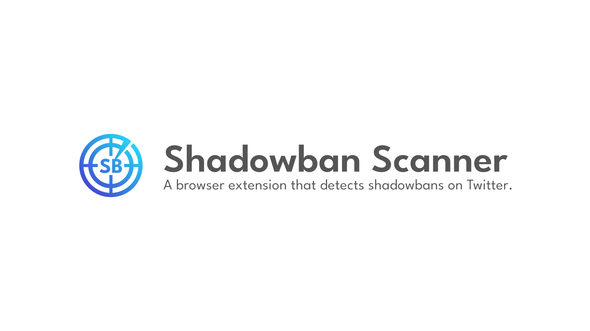
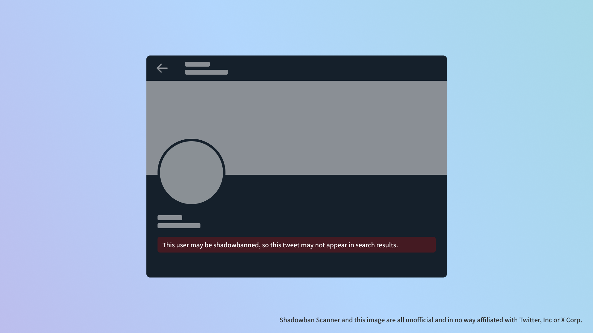

# Shadowban Scanner

[日本語で表示する](README_ja.md)

A browser extension that detects shadowbans on Twitter.



## Installation

- [Chrome version](https://chrome.google.com/webstore/detail/enlganfikppbjhabhkkilafmkhifadjd/)
- [Firefox version](https://addons.mozilla.org/firefox/addon/shadowban-scanner/)

### User Scripts

The settings cannot be changed in the user script version. If you need detailed customization, please use the Browser Extensions version.

- [English](https://raw.githubusercontent.com/Robot-Inventor/shadowban-scanner/main/userScript/en.user.js)
- [日本語](https://raw.githubusercontent.com/Robot-Inventor/shadowban-scanner/main/userScript/ja.user.js)

## Features

- Detects shadowbans per account
- Detects sensitive flags per tweet
- Detects age restrictions on tweets.




## Accuracy

For per-account shadowban detection, as with many other tools, false positives and false negatives can occur. On the other hand, per-tweet sensitive flags and age restrictions can be detected almost flawlessly.

## Detection Methods

Twitter has a ``possibly_sensitive`` flag on a per-account and per-tweet basis.

If the ``possibly_sensitive`` flag for an account is ``true``, the account is most likely shadowbanned. If it has been shadowbanned, tweets may not appear in search results depending on the viewer's account settings. For example, if the viewer's country setting is set to "Japan", tweets from shadowbanned accounts will not appear in search results.

Also, if a tweet's ``possibly_sensitive`` flag is set to ``true``, the tweet may no longer appear in search results. There are two levels of sensitivity flags for tweets. The mildest level will prevent tweets from appearing in search results for accounts that have the Do not show sensitive content setting turned on. Severe ones, in addition to no longer appearing in search results, will also impose age restrictions, preventing underage accounts and non-logged-in users from viewing the tweet.

## Privacy Policy

This extension performs all processing on the user's computer. No data is transmitted to an external server. There is no attempt to access internal APIs by obtaining the user's credentials without their permission, as is the case with some extensions.

## License

This extension is released under the MIT License.

## Development

### Manifest

To generate a Manifest file or change the version, run the following command. ``<manifestVersion>`` can be 2 or 3. Also, the ``version`` field in the Manifest file will be the value of the ``version`` field in ``package.json``.

```console
node script/changeManifestVersion.js <manifestVersion>
```

### Build

```console
npm run build
```

### Package

```console
npm run package
```
