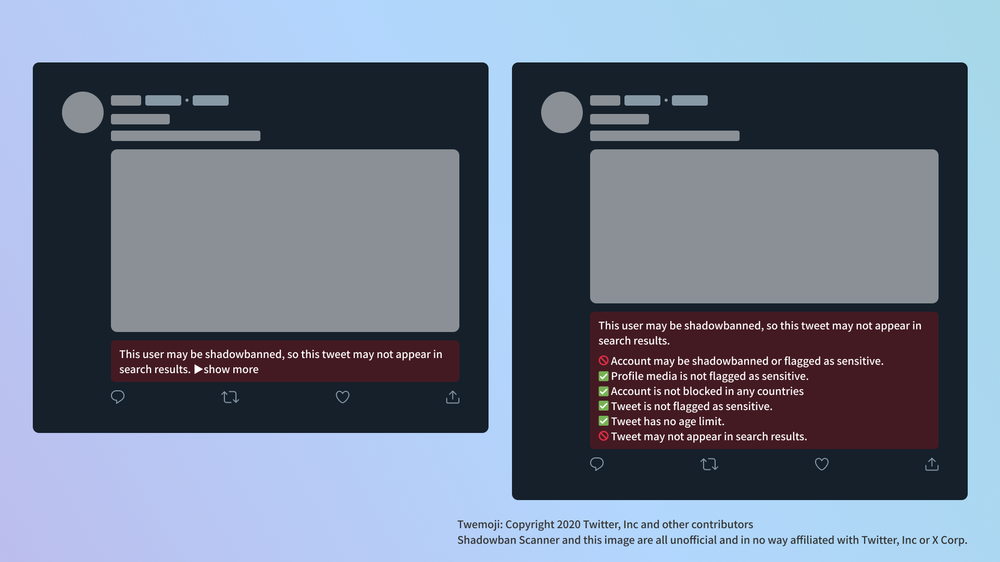

# Shadowban Scanner

[](https://github.com/Robot-Inventor/shadowban-scanner/actions/workflows/build.yml) [](https://github.com/Robot-Inventor/shadowban-scanner/actions/workflows/lint.yml) [](https://github.com/Robot-Inventor/shadowban-scanner/actions/workflows/format.yml)


[日本語で読む](README_ja.md) | [한국어로 읽기](README_ko.md) | [以繁體字閱讀](README_zh_tw.md)

A browser extension that detects shadowbans on Twitter.

## Installation

<p align="center">
<a href="https://chromewebstore.google.com/detail/enlganfikppbjhabhkkilafmkhifadjd"></a>
<a href="https://microsoftedge.microsoft.com/addons/detail/kfeecmboomhggeeceipnbbdjmhjoccbl"></a>
<a href="https://addons.mozilla.org/firefox/addon/{8fee6fa8-6d95-4b9e-9c51-324c207fabff}/"></a>
</p>

### User Scripts

The settings cannot be changed in the user script version. If you need detailed customization, please use the Browser Extensions version.

- [English](https://raw.githubusercontent.com/Robot-Inventor/shadowban-scanner/main/userScript/en.user.js)
- [日本語](https://raw.githubusercontent.com/Robot-Inventor/shadowban-scanner/main/userScript/ja.user.js)
- [한국어](https://raw.githubusercontent.com/Robot-Inventor/shadowban-scanner/main/userScript/ko.user.js)
- [繁體中文](https://raw.githubusercontent.com/Robot-Inventor/shadowban-scanner/main/userScript/zh_TW.user.js)

## Features

- Detects shadowbans and sensitive flags per account
- Detects sensitive flags for profile media (icon and header image)
- Detects countries that block accounts for legal reasons
- Detects sensitive flags per tweet
- Detects age restrictions on tweets
- Adds buttons to show hidden tweets




## Accuracy

When it comes to detecting shadowbans on an account level, like many other tools, there can be instances of false positives and false negatives. However, when it comes to detecting sensitive flags and age restrictions on a tweet level, it can be almost perfectly accurate. Therefore, it is recommended to use Shadowban Scanner to continuously monitor the status of your account and tweets, while also utilizing other tools alongside it.

## Detection Methods

For more information on detection methods and technical details, please refer to the following documents.

- [How Shadowban Scanner Works and About Shadowban](./doc/en/about-shadowban.md)
- [Technical Information on Shadowban Scanner (Japanese)](./doc/en/technical-information.md)

## Privacy Policy

<!-- PRIVACY_POLICY_TEXT_START -->
<!-- THIS SECTION IS GENERATED FROM ./src/_locales/en/messages.json. DO NOT EDIT MANUALLY -->

As a rule, this extension performs all processing on the user's computer. No data is transmitted to an external server. It also does not access Twitter's internal API by obtaining the user's credentials without permission, as is the case with some extensions. Web pages not bundled in this extension are subject to their own terms of use and privacy policies.

<!-- PRIVACY_POLICY_TEXT_END -->

Note that the user script version retrieves images from [https://abs-0.twimg.com/](https://abs-0.twimg.com/) in order to display emojis.

## License

This extension is released under the MIT License.

However, the badge images of each extension store are not subject to the MIT license, and instead are subject to their own branding guidelines and licenses.

## Adding Language Localization

To add a new language, see the [Localization Guide (English)](doc/localization.md).

## Development

### Build

```console
npm run build
```

### Watch

```console
npm run watch
```

### Lint

```console
npm run lint
```

### Format

```console
npm run format
```

### Package

```console
npm run package
```

## Release Procedure

See [doc/release-procedure.md](doc/release-procedure.md).
