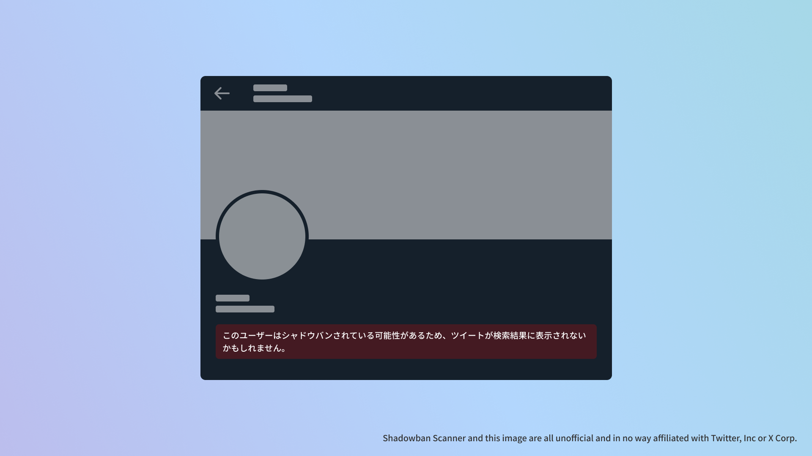
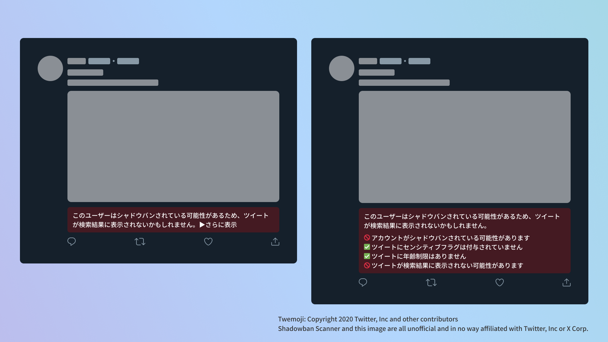

# Shadowban Scanner

[Read in English](README.md)

Twitterのシャドウバンを検出する拡張機能です。


## インストール

- [Chrome版](https://chrome.google.com/webstore/detail/enlganfikppbjhabhkkilafmkhifadjd/)
- [Firefox版](https://addons.mozilla.org/firefox/addon/shadowban-scanner/)

### ユーザースクリプト

ユーザースクリプト版では、設定を変更できません。詳細なカスタマイズが必要な場合はブラウザー拡張機能版をご利用ください。

- [English](https://raw.githubusercontent.com/Robot-Inventor/shadowban-scanner/main/userScript/en.user.js)
- [日本語](https://raw.githubusercontent.com/Robot-Inventor/shadowban-scanner/main/userScript/ja.user.js)

## 機能

- アカウント単位のシャドウバンを検出します
- ツイート単位のセンシティブフラグを検出します
- ツイートの年齢制限を検出します





## 精度

アカウント単位のシャドウバン検出については、他の多くのツールと同様に、偽陽性や偽陰性が発生することがあります。一方で、ツイート単位のセンシティブフラグと年齢制限は、ほとんど完璧に検出できます。

## 検出方法

Twitterには、アカウント単位とツイート単位で``possibly_sensitive``というフラグが存在します。

アカウントの``possibly_sensitive``フラグが``true``の場合、そのアカウントはシャドウバンされている可能性が高いと考えられます。シャドウバンされている場合、閲覧者のアカウントの設定によってはツイートが検索結果に表示されなくなることがあります。たとえば、閲覧者の国の設定が「日本」になっていると、シャドウバンされているアカウントのツイートが検索結果に表示されなくなります。

また、ツイートの``possibly_sensitive``フラグが``true``の場合も、そのツイートが検索結果に表示されなくなることがあります。ツイートのセンシティブフラグには2段階あり、軽度のものでは［センシティブな内容を含むものを表示しない］設定がオンになっているアカウントの検索結果に表示されなくなります。重度のものでは検索結果に表示されなくなるのに加えて、年齢制限がかかり、未成年者のアカウントや非ログイン状態で閲覧できなくなります。

## プライバシーポリシー

この拡張機能は、すべての処理をユーザーのコンピューター上で実行します。データが外部のサーバーに送信されることはありません。また、一部の拡張機能でみられるような、ユーザーの認証情報を無断で取得して内部APIにアクセスするような処理もありません。

## ライセンス

この拡張機能はMITライセンスの下に公開されています。

## 開発

### Manifest

Manifestファイルを生成するか、バージョンを変更する場合は次のコマンドを実行してください。``<manifestVersion>``には2または3を指定できます。また、Manifestファイル内の``version``フィールドは、``package.json``の``version``フィールドの値を使用します。

```console
node script/changeManifestVersion.js <manifestVersion>
```

### ビルド

```console
npm run build
```

### パッケージ化

```console
npm run package
```
