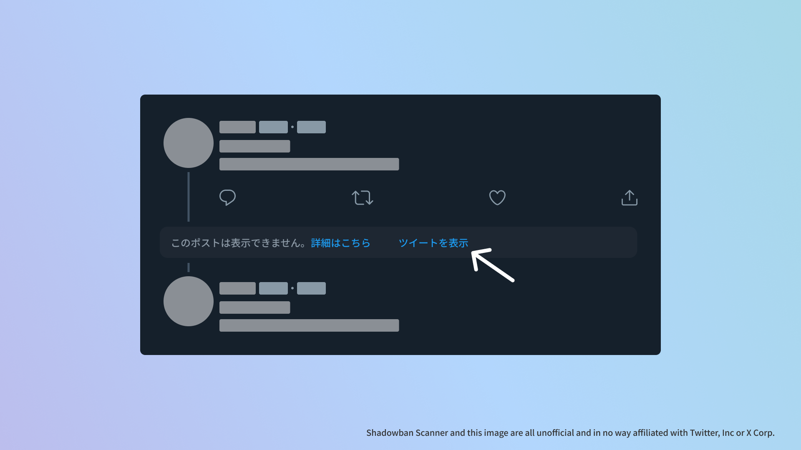

# Shadowban Scanner

[](https://github.com/Robot-Inventor/shadowban-scanner/actions/workflows/build.yml) [](https://github.com/Robot-Inventor/shadowban-scanner/actions/workflows/lint.yml) [](https://github.com/Robot-Inventor/shadowban-scanner/actions/workflows/format.yml)


[Read in English](README.md) | [한국어로 읽기](README_ko.md) | [以繁體字閱讀](README_zh_tw.md)

Twitterのシャドウバンを検出する拡張機能です。

## インストール

<p align="center">
<a href="https://chromewebstore.google.com/detail/enlganfikppbjhabhkkilafmkhifadjd"></a>
<a href="https://microsoftedge.microsoft.com/addons/detail/shadowban-scanner/kfeecmboomhggeeceipnbbdjmhjoccbl"></a>
<a href="https://addons.mozilla.org/firefox/addon/shadowban-scanner/"></a>
</p>

### ユーザースクリプト

ユーザースクリプト版では、設定を変更できません。詳細なカスタマイズが必要な場合はブラウザー拡張機能版をご利用ください。

- [English](https://raw.githubusercontent.com/Robot-Inventor/shadowban-scanner/main/userScript/en.user.js)
- [日本語](https://raw.githubusercontent.com/Robot-Inventor/shadowban-scanner/main/userScript/ja.user.js)
- [한국어](https://raw.githubusercontent.com/Robot-Inventor/shadowban-scanner/main/userScript/ko.user.js)
- [繁體中文](https://raw.githubusercontent.com/Robot-Inventor/shadowban-scanner/main/userScript/zh_TW.user.js)

## 機能

- アカウント単位のシャドウバンとセンシティブフラグを検出します
- プロフィールのメディア（アイコンとヘッダー画像）のセンシティブフラグを検出します
- 法的な理由でアカウントをブロックしている国を検出します
- ツイート単位のセンシティブフラグを検出します
- ツイートの年齢制限を検出します
- 非表示にされたツイートを表示するボタンを追加します




## 精度

アカウント単位のシャドウバン検出については、他の多くのツールと同様に、偽陽性や偽陰性が発生することがあります。一方で、ツイート単位のセンシティブフラグと年齢制限は、ほとんど完璧に検出できます。そのため、Shadowban Scannerで継続的にアカウントやツイートの状態を確認しつつ、他のツールも併せて利用することを推奨します。

## 検出方法

検出方法や技術的な詳細は、次のドキュメントを参照してください。

- [Shadowban Scannerの仕組みとシャドウバンについて](./doc/ja/about-shadowban.md)
- [Shadowban Scannerの技術情報](./doc/ja/technical-information.md)

## プライバシーポリシー

<!-- PRIVACY_POLICY_TEXT_START -->
<!-- THIS SECTION IS GENERATED FROM ./src/_locales/ja/messages.json. DO NOT EDIT MANUALLY -->

この拡張機能は、原則としてすべての処理をユーザーのコンピューター上で実行します。データが外部のサーバーに送信されることはありません。また、一部の拡張機能でみられるような、ユーザーの認証情報を無断で取得してTwitterの内部APIにアクセスする処理もありません。この拡張機能に同梱されていないWebページには、それぞれの利用規約やプライバシーポリシーが適用されます。

<!-- PRIVACY_POLICY_TEXT_END -->

なお、ユーザースクリプト版では絵文字を表示するために、[https://abs-0.twimg.com/](https://abs-0.twimg.com/)から画像を取得します。

## ライセンス

この拡張機能はMITライセンスの下に公開されています。

ただし、各拡張機能ストアのバッジ画像にMITライセンスは適用されず、代わりにそれぞれのブランドガイドラインやライセンスが適用されます。

## 言語ローカライゼーションの追加

新しい言語を追加するには[翻訳ガイド（英語）](doc/localization.md)を参照してください。

## 開発

### ビルド

```console
npm run build
```

### ウォッチ

```console
npm run watch
```

### リント

```console
npm run lint
```

### フォーマット

```console
npm run format
```

### パッケージ化

```console
npm run package
```

## リリース手順

[doc/release-procedure.md](doc/release-procedure.md)を参照。
