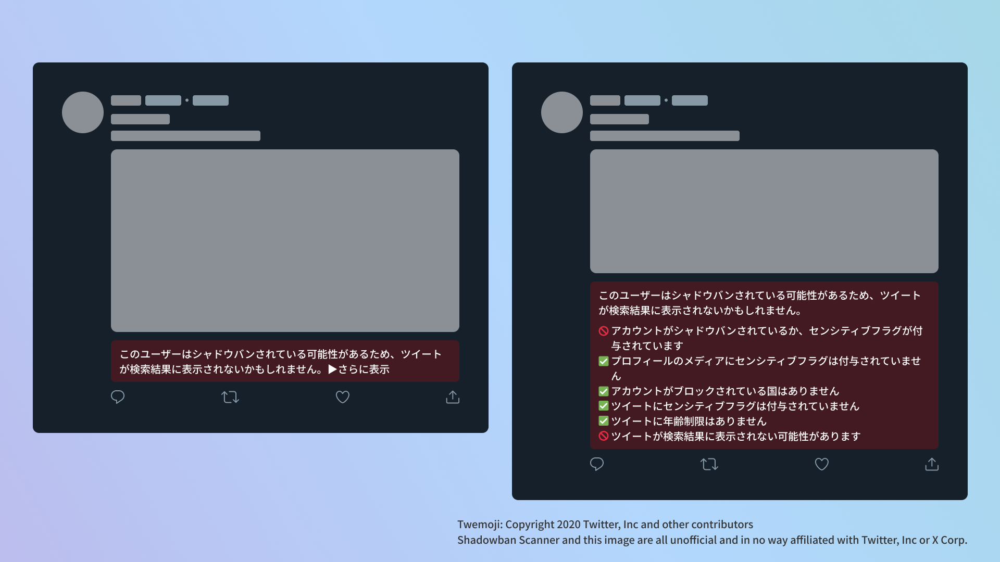

# Shadowban Scanner

[](https://github.com/Robot-Inventor/shadowban-scanner/actions/workflows/build.yml) [](https://github.com/Robot-Inventor/shadowban-scanner/actions/workflows/lint.yml) [](https://github.com/Robot-Inventor/shadowban-scanner/actions/workflows/format.yml)


[Read in English](README.md) | [한국어로 읽기](README_ko.md) | [以繁體字閱讀](README_zh_tw.md)

Twitterのシャドウバンを検出する拡張機能です。

## インストール

- [Chrome](https://chrome.google.com/webstore/detail/enlganfikppbjhabhkkilafmkhifadjd/)
- [Edge](https://microsoftedge.microsoft.com/addons/detail/shadowban-scanner/kfeecmboomhggeeceipnbbdjmhjoccbl)
- [Firefox](https://addons.mozilla.org/firefox/addon/shadowban-scanner/)

### ユーザースクリプト

ユーザースクリプト版では、設定を変更できません。詳細なカスタマイズが必要な場合はブラウザー拡張機能版をご利用ください。

- [English](https://raw.githubusercontent.com/Robot-Inventor/shadowban-scanner/main/userScript/en.user.js)
- [日本語](https://raw.githubusercontent.com/Robot-Inventor/shadowban-scanner/main/userScript/ja.user.js)
- [한국어](https://raw.githubusercontent.com/Robot-Inventor/shadowban-scanner/main/userScript/ko.user.js)
- [繁體字](https://raw.githubusercontent.com/Robot-Inventor/shadowban-scanner/main/userScript/zh_TW.user.js)

## 機能

- アカウント単位のシャドウバンとセンシティブフラグを検出します
- プロフィールのメディア（アイコンとヘッダー画像）のセンシティブフラグを検出します
- ツイート単位のセンシティブフラグを検出します
- ツイートの年齢制限を検出します




## 精度

アカウント単位のシャドウバン検出については、他の多くのツールと同様に、偽陽性や偽陰性が発生することがあります。一方で、ツイート単位のセンシティブフラグと年齢制限は、ほとんど完璧に検出できます。そのため、Shadowban Scannerで継続的にアカウントやツイートの状態を確認しつつ、他のツールも併せて利用することを推奨します。

## 検出方法

検出方法や技術的な詳細は、次のドキュメントを参照してください。

- [Shadowban Scannerの仕組みとシャドウバンについて](./doc/ja/about-shadowban.md)
- [Shadowban Scannerの技術情報](./doc/ja/technical-information.md)

## プライバシーポリシー

この拡張機能は、すべての処理をユーザーのコンピューター上で実行します。データが外部のサーバーに送信されることはありません。また、一部の拡張機能でみられるような、ユーザーの認証情報を無断で取得してTwitterの内部APIにアクセスする処理もありません。

## ライセンス

この拡張機能はMITライセンスの下に公開されています。

## 言語ローカライゼーションの追加

新しい言語を追加するには[翻訳ガイド（英語）](doc/localization.md)を参照してください。

## 開発

### Manifest

Manifestファイルを生成するか、バージョンを変更する場合は次のコマンドを実行してください。``<manifestVersion>``には2または3を指定できます。また、Manifestファイル内の``version``フィールドは、``package.json``の``version``フィールドの値を使用します。

```console
npm run switchManifest <manifestVersion>
```

### ビルド

```console
npm run build
```

### パッケージ化

```console
npm run package
```
