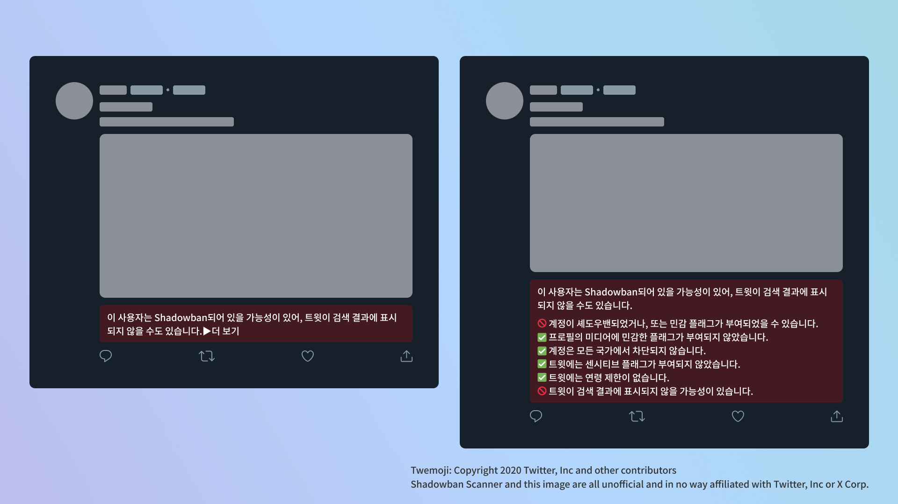

# Shadowban Scanner

[](https://github.com/Robot-Inventor/shadowban-scanner/actions/workflows/build.yml) [](https://github.com/Robot-Inventor/shadowban-scanner/actions/workflows/build.yml) [](https://github.com/Robot-Inventor/shadowban-scanner/actions/workflows/format.yml)

[Read in English](README.md) | [日本語で読む](README_ja.md) | [以繁體字閱讀](README_zh_tw.md)

Twitter의 Shadowban을 감지하는 확장 기능입니다.

※이 문서는 인공지능을 사용하여 일본어에서 한국어로 번역되었습니다. 부자연스러운 점이 있다면 보고해주세요.


## 설치

- [Chrome](https://chrome.google.com/webstore/detail/enlganfikppbjhabhkkilafmkhifadjd/)
- [Edge](https://microsoftedge.microsoft.com/addons/detail/shadowban-scanner/kfeecmboomhggeeceipnbbdjmhjoccbl)
- [Firefox](https://addons.mozilla.org/firefox/addon/shadowban-scanner/)

### 사용자 스크립트

사용자 스크립트 버전에서는 설정을 변경할 수 없습니다. 자세한 사용자 정의가 필요한 경우 브라우저 확장 기능 버전을 사용해주세요.

- [English](https://raw.githubusercontent.com/Robot-Inventor/shadowban-scanner/main/userScript/en.user.js)
- [日本語](https://raw.githubusercontent.com/Robot-Inventor/shadowban-scanner/main/userScript/ja.user.js)
- [한국어](https://raw.githubusercontent.com/Robot-Inventor/shadowban-scanner/main/userScript/ko.user.js)
- [繁體字](https://raw.githubusercontent.com/Robot-Inventor/shadowban-scanner/main/userScript/zh_TW.user.js)

## 기능

- 계정 단위의 Shadowban을 감지합니다
- 프로필 미디어(아이콘과 헤더 이미지)의 민감 정보 플래그를 검출합니다
- 트윗 단위의 민감 정보 플래그를 감지합니다
- 트윗의 연령 제한을 감지합니다




## 정확도

계정 단위의 Shadowban 검출은 다른 많은 도구와 마찬가지로 가짜 양성 또는 가짜 음성이 발생할 수 있습니다. 반면에 트윗 단위의 민감 플래그와 연령 제한은 거의 완벽하게 검출할 수 있습니다. 따라서 Shadowban Scanner를 통해 계정이나 트윗의 상태를 지속적으로 확인하면서 다른 도구들도 함께 사용하는 것을 권장합니다.

## 검출 방법

Twitter에서는 계정 단위와 트윗 단위로 ``possibly_sensitive``라는 플래그가 있습니다.

계정의 "possibly_sensitive" 플래그가 "true"인 경우, 해당 계정은 셰도우밴되어 있을 가능성이 높다고 생각됩니다. 셰도우밴된 경우, 조회자의 계정 설정에 따라 트윗이 검색 결과에 표시되지 않을 수 있습니다. 예를 들어, 조회자의 국가 설정이 "일본"으로 되어 있는 경우, 셰도우밴된 계정의 트윗이 검색 결과에 표시되지 않게 됩니다.

또한, 트윗의 ``possibly_sensitive`` 플래그가 ``true``인 경우에도 해당 트윗이 검색 결과에 표시되지 않을 수 있습니다. 트윗의 센시티브 플래그는 두 단계로 나뉘며, 경미한 경우에는 [센시티브한 내용을 포함한 것을 표시하지 않음] 설정이 켜져 있는 계정의 검색 결과에 표시되지 않게 됩니다. 심각한 경우에는 검색 결과에 표시되지 않는 것에 더해 나이 제한이 적용되어 미성년자 계정이나 비로그인 상태에서 볼 수 없게 됩니다.

## 개인정보 처리 방침

이 확장 기능은 모든 처리를 사용자의 컴퓨터에서 실행합니다. 데이터는 외부 서버로 전송되지 않습니다. 또한, 일부 확장 기능에서 보여지는 것과 같이 사용자의 인증 정보를 무단으로 가져와 내부 API에 액세스하는 처리도 없습니다.

## 라이선스

이 확장 기능은 MIT 라이선스에 따라 공개되어 있습니다.

## 언어 로컬라이제이션 추가

새로운 언어를 추가하려면 [번역 가이드(영어)](doc/localization.md)를 참조하십시오.

## 개발

### 개발

Manifest 파일을 생성하거나 버전을 변경하려면 다음 명령을 실행하세요. ``<manifestVersion>``에는 2 또는 3을 지정할 수 있습니다. 또한 Manifest 파일 내의 ``version`` 필드는 ``package.json``의 ``version`` 필드 값을 사용합니다.

```console
node script/changeManifestVersion.js <manifestVersion>
```

### 빌드

```console
npm run build
```

### 패키징

```console
npm run package
```
