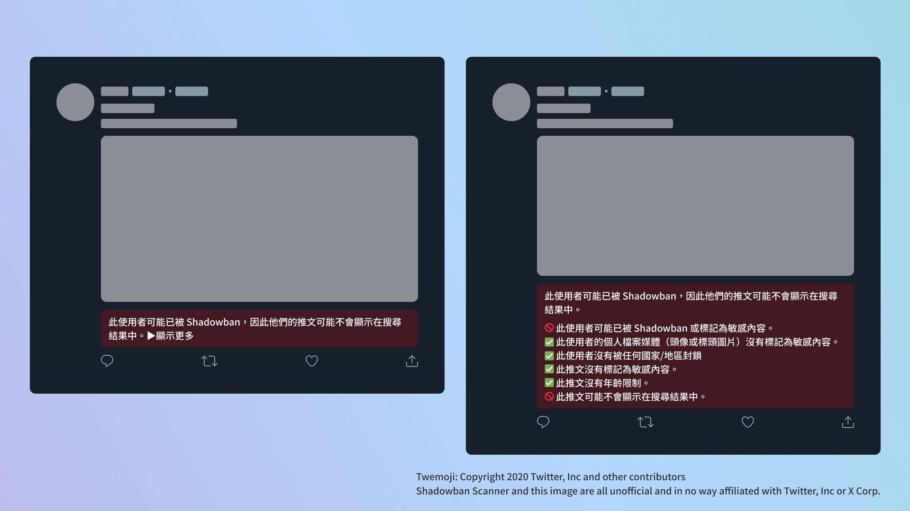
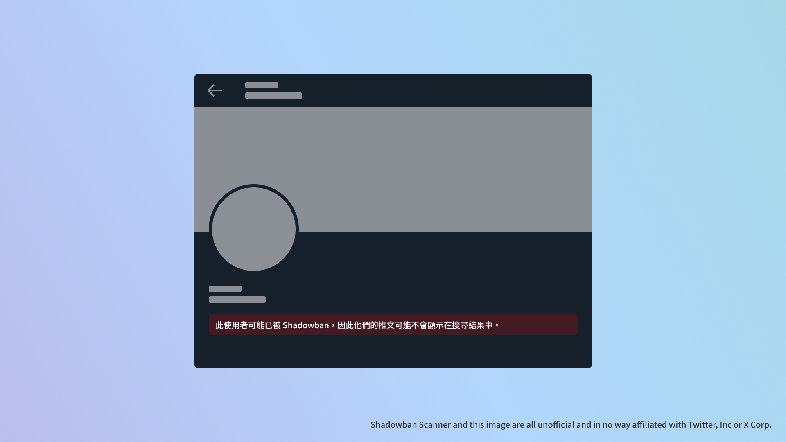

# Shadowban Scanner

[Read in English](README.md) | [日本語で読む](README_ja.md) | [한국어로 읽기](README_ko.md)

這是一個用於檢測Twitter的Shadowban的擴充功能。

※此文档经由人工智能将日语翻译为繁体字。如有不自然之处，请及时报告。


## 安裝

- [Chrome版](https://chrome.google.com/webstore/detail/enlganfikppbjhabhkkilafmkhifadjd/)
- [Firefox版](https://addons.mozilla.org/firefox/addon/shadowban-scanner/)

### 使用者腳本

使用者腳本版中，無法進行設定變更。如需進行詳細客製化，請使用瀏覽器擴充功能版。

- [English](https://raw.githubusercontent.com/Robot-Inventor/shadowban-scanner/main/userScript/en.user.js)
- [日本語](https://raw.githubusercontent.com/Robot-Inventor/shadowban-scanner/main/userScript/ja.user.js)
- [한국어](https://raw.githubusercontent.com/Robot-Inventor/shadowban-scanner/main/userScript/ko.user.js)
- [繁體字](https://raw.githubusercontent.com/Robot-Inventor/shadowban-scanner/main/userScript/zh_TW.user.js)

## 功能

- 偵測帳戶層級的Shadowban
- 偵測推文層級的敏感標籤
- 偵測推文的年齡限制





## 精確性

就帳號層級的shadowban檢測而言，與其他許多工具一樣，可能會發生偽陽性或偽陰性的情況。然而，針對推文層級的敏感標記和年齡限制，我們幾乎可以完美地進行檢測。因此，建議您在使用Shadowban Scanner持續確認帳號和推文的狀態之餘，也同時使用其他工具。

## 檢測方法

Twitter中存在著以帳號和推文為單位的``possibly_sensitive``標記。

如果帳號的``possibly_sensitive``標記為``true``，那麼該帳號很可能遭到了Shadowban。若帳號被Shadowban，根據訪問者的帳號設定，推文可能不會出現在搜尋結果中。舉例來說，如果訪問者的國家設定是「日本」，那麼被Shadowban的帳號的推文將不會在搜尋結果中顯示。

此外，如果推文的 ``possibly_sensitive`` 标志设置为 ``true``，该推文也可能不会出现在搜索结果中。推文的敏感标志有两个级别，轻度级别会使带有敏感内容的推文不会出现在启用了 "不显示包含敏感内容的推文" 设置的帐户的搜索结果中。重度级别不仅会使推文不再出现在搜索结果中，还会对其施加年龄限制，这意味着未成年人的帐户或未登录状态下无法查看。

## 隐私政策

本扩展程序会在用户的计算机上进行所有处理。数据不会被发送到外部服务器。此外，也不会进行类似某些扩展程序那样，未经授权获取用户的认证信息并访问内部API的处理。

## 许可证

该扩展程序采用MIT许可证发布。

## 添加語言本地化

請參考[翻譯指南（英文）](doc/localization.md)以添加新語言。

## 開発

### Manifest

請執行以下指令以生成 Manifest 檔案或更改版本。您可以將 ``<manifestVersion>`` 設定為 2 或 3。此外，Manifest 檔案中的 ``version`` 欄位將使用 ``package.json`` 中的 ``version`` 欄位值。

```console
node script/changeManifestVersion.js <manifestVersion>
```

### 建置

```console
npm run build
```

### 封裝

```console
npm run package
```
