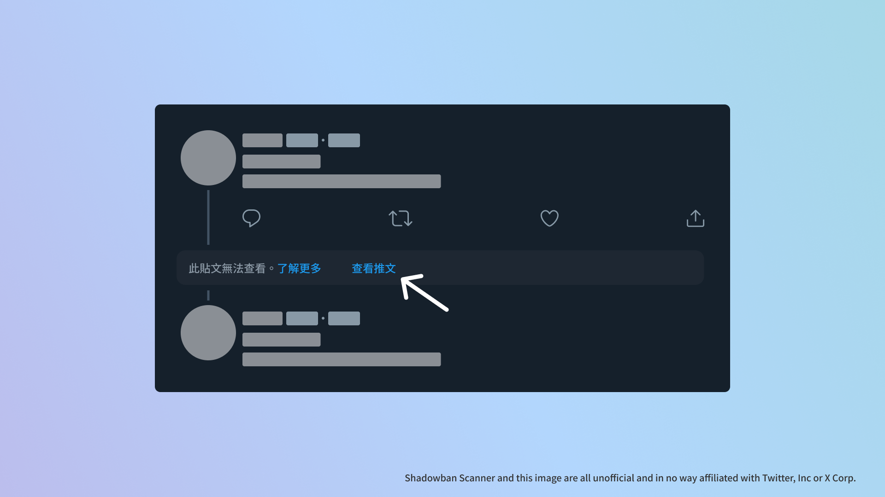

# Shadowban Scanner

  

[Read in English](README.md) | [日本語で読む](README_ja.md) | [한국어로 읽기](README_ko.md)

這是一個用於檢查 Twitter 的 Shadowban 的擴充功能。

## 安裝

### 使用者腳本

使用者腳本版中，無法進行設定變更。如需自訂，請使用瀏覽器擴充功能版。

- [English](https://raw.githubusercontent.com/Robot-Inventor/shadowban-scanner/main/userScript/en.user.js)
- [日本語](https://raw.githubusercontent.com/Robot-Inventor/shadowban-scanner/main/userScript/ja.user.js)
- [한국어](https://raw.githubusercontent.com/Robot-Inventor/shadowban-scanner/main/userScript/ko.user.js)
- [繁體中文](https://raw.githubusercontent.com/Robot-Inventor/shadowban-scanner/main/userScript/zh_TW.user.js)

## 功能

- 偵測帳戶層級的 Shadowban 和敏感內容標記
- 檢查個人檔案的媒體（頭像或標頭圖片）的敏感內容標記
- 檢查帳戶因法律原因而被封鎖的國家/地區
- 偵測推文層級的敏感內容標記
- 偵測推文的年齡限制
- 在設置為隱藏的推文中增加查看的按鈕

## 精確性

就帳號層級的 Shadowban 檢查而言，與其他許多工具一樣，可能會發生誤判的情況。然而，針對推文層級的敏感內容標記和年齡限制，此擴充功能幾乎可以完美地得出正確結果。因此，建議您在使用 Shadowban Scanner 確認帳號和推文的狀態之餘，同時使用其他工具協助。

## 檢查方法

檢查方法和技術細節請參考以下說明：

- [How Shadowban Scanner Works and About Shadowban (English)](./doc/en/about-shadowban.md)
- [Technical Information on Shadowban Scanner (Japanese)](./doc/en/technical-information.md)

## Privacy Policy

<!-- PRIVACY_POLICY_TEXT_START -->
<!-- THIS SECTION IS GENERATED FROM ./src/_locales/zh_TW/messages.json. DO NOT EDIT MANUALLY -->

此擴充功能原則上會在使用者的電腦上處理所有資料，不會傳送到外部伺服器，而且此擴充功能不會在未經使用者許可的情況下使用登入認證存取 Twitter/X 的內部 API。對於此擴充功能沒有對應的網頁，將適用各自的使用條款和隱私政策。

<!-- PRIVACY_POLICY_TEXT_END -->

Note that the user script version retrieves images from [https://abs-0.twimg.com/](https://abs-0.twimg.com/) in order to display emojis.

## License

This extension is released under the MIT License.

However, the badge images of each extension store are not subject to the MIT license, and instead are subject to their own branding guidelines and licenses.

## Contributing

To change the code or improve documentation and translations, see the [Contributing Guide](CONTRIBUTING.md).

## Release Procedure

See [doc/release-procedure.md](doc/release-procedure.md).
