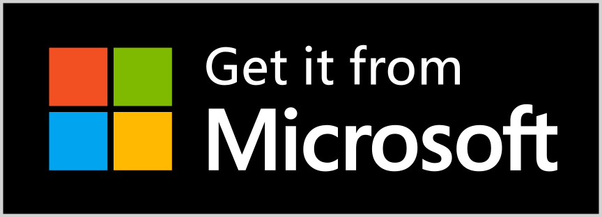

# Shadowban Scanner

[](https://github.com/Robot-Inventor/shadowban-scanner/actions/workflows/build.yml) [](https://github.com/Robot-Inventor/shadowban-scanner/actions/workflows/lint.yml) [](https://github.com/Robot-Inventor/shadowban-scanner/actions/workflows/format.yml)


[Read in English](README.md) | [日本語で読む](README_ja.md) | [한국어로 읽기](README_ko.md)

這是一個用於檢測Twitter的Shadowban的擴充功能。

※此文档经由人工智能将日语翻译为繁体字。如有不自然之处，请及时报告。

## 安裝

<p align="center">
<a href="https://chrome.google.com/webstore/detail/enlganfikppbjhabhkkilafmkhifadjd/"></a>
<a href="https://microsoftedge.microsoft.com/addons/detail/shadowban-scanner/kfeecmboomhggeeceipnbbdjmhjoccbl"></a>
<a href="https://addons.mozilla.org/firefox/addon/shadowban-scanner/"></a>
</p>

### 使用者腳本

使用者腳本版中，無法進行設定變更。如需進行詳細客製化，請使用瀏覽器擴充功能版。

- [English](https://raw.githubusercontent.com/Robot-Inventor/shadowban-scanner/main/userScript/en.user.js)
- [日本語](https://raw.githubusercontent.com/Robot-Inventor/shadowban-scanner/main/userScript/ja.user.js)
- [한국어](https://raw.githubusercontent.com/Robot-Inventor/shadowban-scanner/main/userScript/ko.user.js)
- [繁體字](https://raw.githubusercontent.com/Robot-Inventor/shadowban-scanner/main/userScript/zh_TW.user.js)

## 功能

- 偵測帳戶層級的Shadowban和敏感標誌
- 檢測個人檔案的媒體（圖示與標頭圖片）敏感性標籤
- 偵測推文層級的敏感標籤
- 偵測推文的年齡限制


## 精確性

就帳號層級的shadowban檢測而言，與其他許多工具一樣，可能會發生偽陽性或偽陰性的情況。然而，針對推文層級的敏感標記和年齡限制，我們幾乎可以完美地進行檢測。因此，建議您在使用Shadowban Scanner持續確認帳號和推文的狀態之餘，也同時使用其他工具。

## 檢測方法

檢測方法和技術細節請參考以下文檔：

- [How Shadowban Scanner Works and About Shadowban (English)](./doc/en/about-shadowban.md)
- [Technical Information on Shadowban Scanner (Japanese)](./doc/en/technical-information.md)

## Privacy Policy

As a rule, this extension performs all processing on the user's computer. No data is transmitted to an external server. It also does not access Twitter's internal API by obtaining the user's credentials without permission, as is the case with some extensions. Web pages not bundled in this extension are subject to their own terms of use and privacy policies.

Note that the user script version retrieves images from [https://abs-0.twimg.com/](https://abs-0.twimg.com/) in order to display emojis.

## License

This extension is released under the MIT License.

However, the badge images of each extension store are not subject to the MIT license, and instead are subject to their own branding guidelines and licenses.

## Adding Language Localization

To add a new language, see the [Localization Guide (English)](doc/localization.md).

## Development

### Manifest

To generate a Manifest file or change the version, run the following command. ``<manifestVersion>`` can be 2 or 3. Also, the ``version`` field in the Manifest file will be the value of the ``version`` field in ``package.json``.

```console
npm run switchManifest <manifestVersion>
```

### Build

```console
npm run build
```

### Package

```console
npm run package
```

## Release Procedure

See [doc/release-procedure.md](doc/release-procedure.md).
